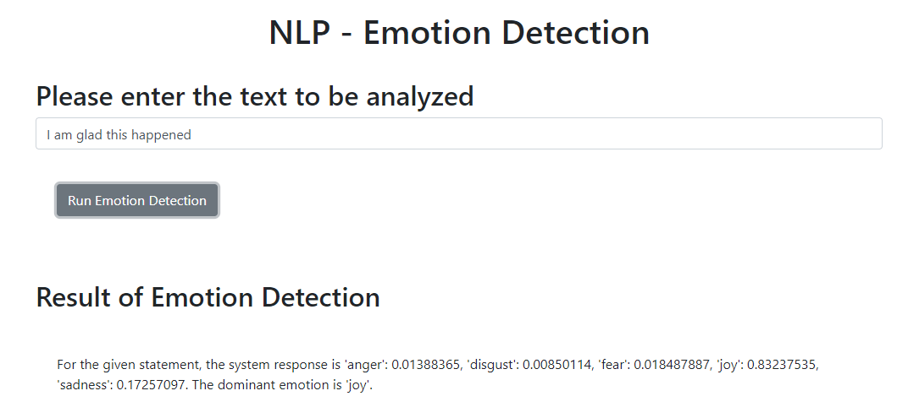
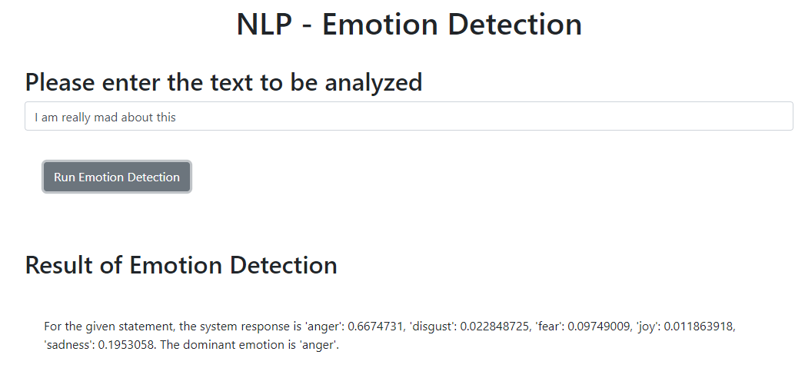
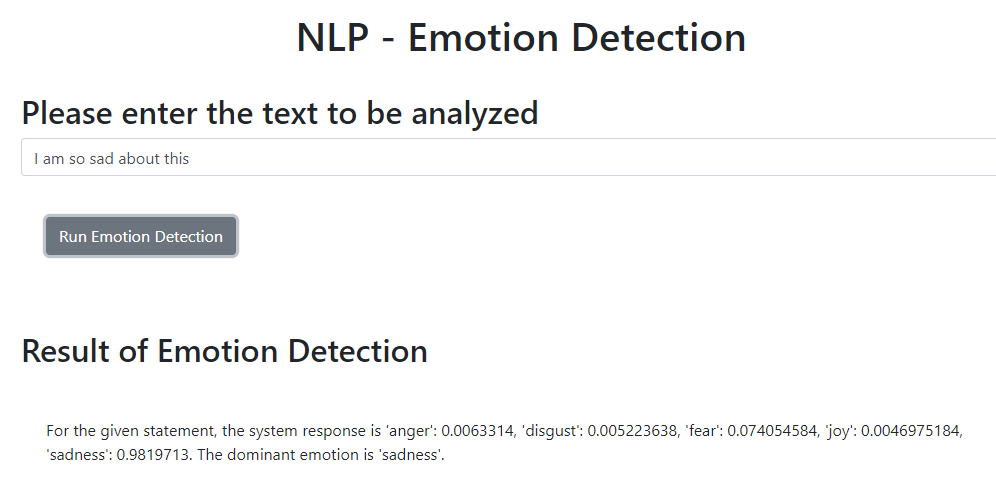
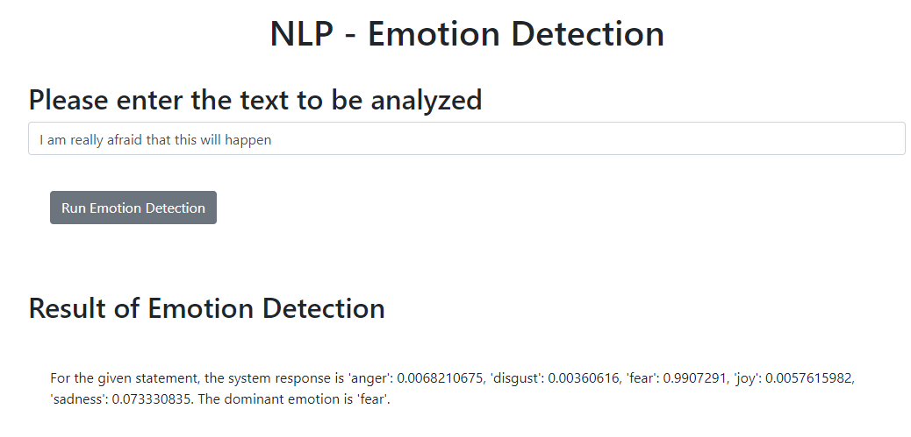
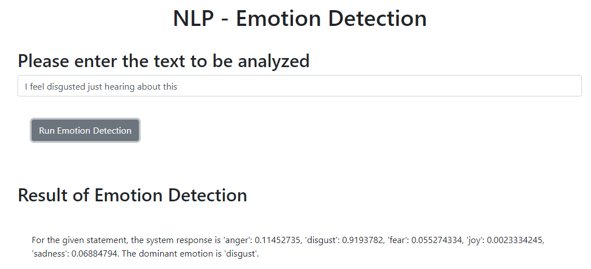

<h1>Emotion Detection System</h1>

    This project is an <strong>Emotion Detection System</strong> developed using Python and Flask. 
    It processes customer feedback provided in text format and deciphers the emotions expressed, such as joy, sadness, anger, and more. 
    This project leverages IBM's Watson AI libraries to extract emotions and provide deeper insights beyond the simple polarity of sentiment analysis.

<h2>Introduction</h2>

    Emotion detection goes beyond traditional sentiment analysis by identifying specific emotions embedded within textual feedback. 
    This allows businesses to gain a deeper understanding of their customers' feelings and can be used in various applications such as:

<ul>
    <li>AI-based recommendation systems</li>
    <li>Automated customer service chatbots</li>
    <li>Feedback analysis for product improvement</li>
    <li>Social media sentiment tracking</li>
</ul>

<h2>Key Features</h2>

<ul>
    <li><strong>Emotion Detection:</strong> Identifies emotions like joy, sadness, anger, fear, disgust, etc.</li>
    <li><strong>Real-time Analysis:</strong> Provides instant emotion detection based on customer feedback.</li>
    <li><strong>Watson AI Integration:</strong> Utilizes IBM Watson's AI libraries for enhanced emotion detection accuracy.</li>
    <li><strong>Web-based Interface:</strong> Built using Flask for easy interaction through a web interface.</li>
</ul>

<h2>Technologies Used</h2>

<ul>
    <li><strong>Python:</strong> The core programming language used to build the application.</li>
    <li><strong>Flask:</strong> A lightweight web framework for Python used to create the web interface.</li>
    <li><strong>IBM Watson AI:</strong> Watson Natural Language Understanding API is used for emotion detection.</li>
    <li><strong>HTML/CSS/JavaScript:</strong> Used to build the front-end of the web application.</li>
    <li><strong>Bootstrap:</strong> A front-end framework for building responsive and mobile-first web pages.</li>
    <li><strong>Git:</strong> Version control system for managing the project source code.</li>
</ul>

<h2>Installation</h2>

To run this project locally, follow these steps:

<ol>
    <li>Clone the repository:
        <pre><code>git clone https://github.com/RikGanguli/Emotion-Detector.git</code></pre>
    </li>
    <li>Navigate to the project directory:
        <pre><code>cd Emotion-Detector</code></pre>
    </li>
    <li>Create and activate a virtual environment (optional but recommended):
        <pre><code>python -m venv venv
source venv/bin/activate   # On Windows: venv\Scripts\activate</code></pre>
    </li>
    <li>Run the Flask application:
        <pre><code>python server.py</code></pre>
    </li>
    <li>Open your browser and navigate to:
        <pre><code>http://127.0.0.1:5000/</code></pre>
    </li>
</ol>

<h2>Environment Variables</h2>

    The application requires the following environment variables to be set:

<pre><code>
WATSON_API_KEY=your_watson_api_key
WATSON_URL=your_watson_service_url
</code></pre>

<h2>How It Works</h2>

<ol>
    <li>The user submits customer feedback via the web interface.</li>
    <li>The feedback text is processed by Watson AI’s Natural Language Understanding (NLU) API.</li>
    <li>The system extracts and returns the emotion expressed in the text.</li>
    <li>The detected emotions are displayed to the user via the Flask-powered web interface.</li>
</ol>

<h2>Screenshots:</h2>
<ol>
  <li>
    <h3>Detected Joy:</h3>
    
  </li>
  <li>
    <h3>Detected Anger:</h3>
    
  </li>
  <li>
    <h3>Detected Sadness:</h3>
    
  </li>
  <li>
    <h3>Detected Fear:</h3>
    
  </li>
  <li>
    <h3>Detected Disgust:</h3>
    
  </li>
</ol>

<h2>Requirements</h2>

To run the project, ensure you have the following:

<ul>
    <li>Python 3.x</li>
    <li>Flask</li>
    <li>IBM Watson AI SDK</li>
</ul>

<h2>Credits:</h2>

Developed by Rik Ganguli Biswas as a part of the IBM AI Developer Professional Certificate

